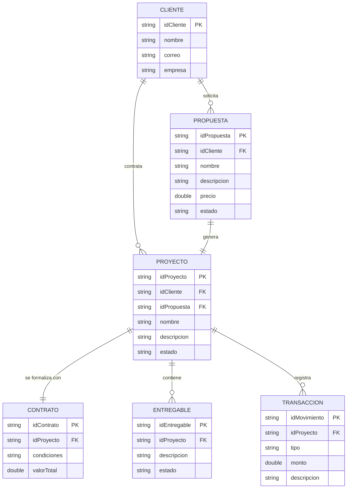

<h3 align="center";>

**GESTOR DE PORTAFOLIO DE PROYECTOS FREELANCE**

</h3>

<br>
<br>
<br>

<h3 align="center";>

**Juan Santoyo**

</h3>

<h3 align="center";>

**Omar Fernandez**

</h3>

<br>
<br>
<br>
<br>

<h3 align="center";>

**S1**

</h3>

<h3 align="center";>

**Pedro Felipe Gómez Bonilla**

</h3>

<br>
<br>
<br>
<br>

<h3 align="center";>

**CAMPUSLANDS**

</h3>

<h3 align="center";>

**RUTA NODE**

</h3>

<h3 align="center";>

**BUCARAMANGA, SANTANDER**

</h3>

<h3 align="center";>

**2025**

</h3>

---
<h1 align="center";>

# Introducción

</h1>

Este documento servirá como una guía detallada del proceso completo de diseño, estructuración e implementación de una aplicación de línea de comandos (CLI) para la gestión de portafolios de proyectos freelance. El objetivo principal es desarrollar una herramienta robusta que permita a los profesionales independientes administrar eficazmente clientes, propuestas, proyectos, contratos, entregables y transacciones financieras.

Inicialmente, se analizará el caso de estudio que motiva la creación de esta herramienta, junto con los requerimientos específicos del sistema. A partir de esta investigación, se procederá a desarrollar un modelo conceptual detallado donde se identificarán las entidades principales, sus atributos y las relaciones entre ellas. Este paso sienta las bases para comprender la estructura esencial del sistema de gestión.

A continuación, se realizará la conversión del modelo conceptual al modelo lógico, enfocado en una base de datos NoSQL (MongoDB). En esta sección, en lugar de la normalización tradicional, se discutirán las estrategias de modelado de datos, como el uso de referencias y documentos embebidos, para optimizar la estructura de los datos, garantizar la consistencia y minimizar la redundancia.

Posteriormente, se llevará a cabo la conversión del modelo lógico al modelo físico, que define la implementación real de las colecciones, sus validaciones de esquema y las relaciones, incorporando detalles técnicos como los tipos de datos adecuados para cada campo.

Finalmente, se detallará la arquitectura del software, incluyendo los principios SOLID y los patrones de diseño (Repository, Command) que guían la implementación, asegurando un sistema mantenible, escalable y eficiente.

---
<h1 align="center";>

# Caso de Estudio

</h1>

A medida que un profesional freelance tiene éxito y su cartera de clientes crece, la complejidad de la gestión administrativa aumenta exponencialmente. Sin una herramienta adecuada, el freelancer se enfrenta a un conjunto de desafíos que pueden frenar su crecimiento y afectar su rentabilidad.

**Los Desafíos Comunes:**

1.  **Fragmentación de la Información:** Los datos cruciales del negocio se encuentran dispersos en múltiples plataformas: la información de los clientes en una aplicación de contactos, los detalles de los proyectos en un gestor de tareas, las conversaciones en el correo electrónico y los registros financieros en hojas de cálculo. Esta fragmentación hace que encontrar información sea un proceso lento e ineficiente.

2.  **Procesos Manuales y Repetitivos:** Tareas como la creación de propuestas, la redacción de contratos y la facturación se convierten en un trabajo manual y repetitivo. Esto no solo consume un tiempo valioso que podría dedicarse a tareas facturables, sino que también aumenta el riesgo de cometer errores costosos, como olvidar cláusulas importantes o equivocarse en los montos.

3.  **Falta de Visibilidad y Control:** Sin un sistema centralizado, es difícil tener una visión clara del estado de todos los proyectos. El seguimiento de los entregables, el cumplimiento de los plazos y la gestión de las expectativas del cliente se vuelven complicados, lo que puede llevar a retrasos, malentendidos y una percepción de falta de profesionalismo.

4.  **Gestión Financiera Ineficiente:** Llevar un control preciso de los ingresos y gastos por proyecto es un reto. Calcular la rentabilidad real de un trabajo o tener una previsión financiera clara requiere un esfuerzo manual considerable, lo que dificulta la toma de decisiones estratégicas para el negocio.

**La Necesidad:**
Surge la necesidad crítica de una **solución de gestión unificada** que centralice todas las operaciones del negocio freelance. Una herramienta que automatice las tareas repetitivas, proporcione una visión clara del estado de todos los proyectos y finanzas, y permita al profesional gestionar su negocio de manera eficiente, idealmente desde su propio entorno de trabajo: la línea de comandos.

---
<h1 align="center";>

# Requisitos del Sistema

</h1>

Para ejecutar correctamente la aplicación, es necesario contar con el siguiente software instalado:

-   **Node.js:** versión 18.x o superior.
-   **NPM (Node Package Manager):** Generalmente se instala junto con Node.js.
-   **MongoDB:** versión 5.x o superior.
-   **Git:** Para clonar el repositorio desde GitHub.

---

<h1 align="center";>

# Instalación y Configuración

</h1>

Para instalar y ejecutar este proyecto localmente, sigue estos pasos:

1.  **Clona el repositorio:**
    ```bash
    git clone https://github.com/JuanSantoyoJ/Proyecto_S1_Node.JS_SantoyoJuan_GranadosOmar
    ```

2.  **Navega a la carpeta del proyecto:**
    ```bash
    cd Proyecto_S1_Node.JS_SantoyoJuan_GranadosOmar
    ```

3.  **Instala las dependencias:**
    ```bash
    npm install
    ```

4.  **Configura las variables de entorno:**
    *   Crea un archivo `.env` en la raíz del proyecto.
    *   Añade la siguiente línea, reemplazando `<TU_CONNECTION_STRING>` con tu cadena de conexión de MongoDB:
        ```
        MONGO_URI=<TU_CONNECTION_STRING>
        ```

5.  **Ejecuta la aplicación:**
    ```bash
    node app.js
    ```

---

## Documentación de SCRUM

**[Documentación de SCRUM](./SCRUM/Proyecto_NodeS1_SantoyoJuan_OmarGranados.docx.pdf)**

---

<h1 align="center";>

# Planificación y Diseño de la Base de Datos

</h1>

## Construcción del Modelo Conceptual

El modelo conceptual proporciona una descripción de alto nivel de las necesidades de información del sistema. Representa los conceptos principales (entidades) y las relaciones entre ellos.

**Entidades y Atributos**

1.  **Cliente:** Representa a un cliente del freelancer.
    -   `idCliente`: Identificador único.
    -   `nombre`: Nombre del cliente.
    -   `correo`: Correo electrónico.
    -   `empresa`: Empresa a la que pertenece.

2.  **Propuesta:** Documento de oferta para un posible proyecto.
    -   `idPropuesta`: Identificador único.
    -   `nombre`: Título de la propuesta.
    -   `descripcion`: Detalles de la propuesta.
    -   `precio`: Costo estimado.
    -   `plazo`: Tiempo de entrega estimado.
    -   `estado`: (Ej: 'Enviada', 'Aceptada', 'Rechazada').

3.  **Proyecto:** Un trabajo contratado por un cliente.
    -   `idProyecto`: Identificador único.
    -   `nombre`: Nombre del proyecto.
    -   `descripcion`: Detalles del proyecto.
    -   `estado`: (Ej: 'Activo', 'Completado', 'Pausado').
    -   `fechaInicio`, `fechaFin`: Fechas del proyecto.

4.  **Contrato:** Acuerdo formal que vincula un proyecto.
    -   `idContrato`: Identificador único.
    -   `condiciones`: Términos y condiciones.
    -   `valorTotal`: Monto final acordado.

5.  **Entregable:** Un hito o producto específico dentro de un proyecto.
    -   `idEntregable`: Identificador único.
    -   `descripcion`: Detalles del entregable.
    -   `fechaLimite`: Fecha de entrega.
    -   `estado`: (Ej: 'Pendiente', 'En revisión', 'Aprobado').

6.  **Transacción:** Un movimiento financiero asociado a un proyecto.
    -   `idMovimiento`: Identificador único.
    -   `tipo`: (Ej: 'Ingreso', 'Gasto').
    -   `monto`: Cantidad de dinero.
    -   `fecha`: Fecha de la transacción.
    -   `descripcion`: Detalles del movimiento.

**Relaciones y Cardinalidades**

-   Un `Cliente` puede tener muchas `Propuestas` (1:N).
-   Un `Cliente` puede tener muchos `Proyectos` (1:N).
-   Una `Propuesta` aceptada genera un `Proyecto` (1:1).
-   Un `Proyecto` tiene un `Contrato` (1:1).
-   Un `Proyecto` se compone de muchos `Entregables` (1:N).
-   Un `Proyecto` tiene muchas `Transacciones` financieras (1:N).

**Diagrama Conceptual (ER)**



## Construcción del Modelo Lógico (Modelado NoSQL)

En esta fase, se traduce el modelo conceptual a una estructura de colecciones y documentos para MongoDB. Las decisiones clave giran en torno a si usar **referencias** (linking) o **documentos embebidos** (embedding).

**Estrategia de Modelado**

Se optará por un **modelo híbrido**, favoreciendo las **referencias** para las entidades principales para mantener la consistencia y evitar la duplicación masiva de datos. Los datos que son intrínsecos a una entidad y no muy extensos se pueden embeber.

-   **Referencias (Linking):** Se usará para relaciones 1:N donde las entidades "N" pueden crecer indefinidamente o necesitan ser consultadas de forma independiente. Por ejemplo, la relación entre `Cliente` y `Proyecto`. Un cliente puede tener muchos proyectos, y queremos poder listar todos los proyectos sin necesidad de cargar la información completa de cada cliente. Se almacenará el `_id` del cliente dentro de cada documento de proyecto.
    -   **Ventajas:** Datos consistentes, menor duplicación, documentos más pequeños y eficientes.
    -   **Desventajas:** Requiere una consulta adicional (`$lookup` o una segunda query) para obtener los datos relacionados.

-   **Embebido (Embedding):** Se podría usar para relaciones 1:1 o 1:N con un número limitado y pequeño de sub-documentos. Por ejemplo, si un proyecto tuviera un conjunto pequeño y fijo de "tags" o "categorías", podrían ser embebidos. En nuestro caso, la mayoría de las relaciones son con entidades que pueden crecer, por lo que se priorizarán las referencias. La relación `Proyecto` -> `Contrato` es 1:1 y podría ser un candidato para embeber el contrato dentro del proyecto, pero separarlos como colecciones distintas ofrece más flexibilidad si el contrato evoluciona.

**Colecciones Definidas**

1.  `clients`: Almacena los documentos de los clientes.
2.  `proposals`: Almacena las propuestas, con una referencia al `_id` del cliente.
3.  `projects`: Almacena los proyectos, con referencias al `_id` del cliente y al `_id` de la propuesta original.
4.  `contracts`: Almacena los contratos, con una referencia al `_id` del proyecto.
5.  `deliverables`: Almacena los entregables, con una referencia al `_id` del proyecto.
6.  `transactions`: Almacena los movimientos financieros, con una referencia al `_id` del proyecto.

Esta estructura basada en referencias es análoga a tener tablas separadas en SQL con claves foráneas, lo que garantiza que cada pieza de información (como los datos de un cliente) se almacena una sola vez (Single Source of Truth).

## Construcción del Modelo Físico

El modelo físico define la implementación final en MongoDB, incluyendo los tipos de datos y las reglas de validación de esquema para cada colección.

-   **Para crear y usar la base de datos:**
    ```javascript
    use GestorFreelanceDB
    ```

-   **Creación de Colecciones con Validación de Esquema:**

    1.  **Colección `clients`**
        ```javascript
        db.createCollection("clients", {
           validator: {
              $jsonSchema: {
                 bsonType: "object",
                 required: ["name", "email"],
                 properties: {
                    name: { bsonType: "string", description: "must be a string and is required" },
                    email: { bsonType: "string", pattern: "@mongodb\.com$", description: "must be a string and match the regular expression pattern" },
                    company: { bsonType: "string", description: "must be a string if the field exists" }
                 }
              }
           }
        })
        ```

    2.  **Colección `projects`**
        ```javascript
        db.createCollection("projects", {
           validator: {
              $jsonSchema: {
                 bsonType: "object",
                 required: ["clientId", "name", "status"],
                 properties: {
                    clientId: { bsonType: "objectId", description: "must be an objectId and is required" },
                    name: { bsonType: "string", description: "must be a string and is required" },
                    description: { bsonType: "string" },
                    status: { enum: ["active", "completed", "paused"], description: "can only be one of the enum values and is required" },
                    startDate: { bsonType: "date" },
                    endDate: { bsonType: "date" }
                 }
              }
           }
        })
        ```
    *(... y así sucesivamente para las demás colecciones: `proposals`, `contracts`, `deliverables`, `transactions`, cada una con su respectivo esquema y referencias a otras colecciones mediante `bsonType: "objectId"`)*

---
<h1 align="center";>

# Arquitectura del Software

</h1>

El proyecto está organizado siguiendo una arquitectura que separa las responsabilidades en diferentes capas, facilitando su mantenimiento y escalabilidad.

```
/
├── app.js                # Punto de entrada de la aplicación
├── db.js                 # Configuración y conexión de la base de datos
├── package.json          # Dependencias y scripts del proyecto
├── README.md             # Documentación del proyecto
├── commands/             # (Patrón Command) Comandos que encapsulan las acciones
├── controllers/          # Lógica de negocio y coordinación
├── models/               # Definición de los modelos de datos
├── repositories/         # (Patrón Repository) Abstracción del acceso a datos
└── views/                # Manejo de la interfaz de línea de comandos (CLI)
```

## Principios SOLID Aplicados

-   **Principio de Responsabilidad Única (SRP):** Cada clase tiene una única responsabilidad. Las `Views` manejan la interacción con el usuario, los `Controllers` orquestan la lógica de negocio, los `Repositories` gestionan el acceso a datos y los `Models` definen la estructura de los datos.
-   **Principio de Abierto/Cerrado (OCP):** La arquitectura permite añadir nuevas funcionalidades (como nuevos comandos o entidades) creando nuevas clases sin necesidad de modificar el código existente.
-   **Principio de Sustitución de Liskov (LSP):** Se aplica en la implementación de los patrones, donde las clases base pueden ser sustituidas por sus subtipos sin alterar el comportamiento del programa.
-   **Principio de Segregación de Interfaces (ISP):** Se definen interfaces específicas para cada tipo de operación, evitando que las clases implementen métodos que no necesitan.
-   **Principio de Inversión de Dependencias (DIP):** Los módulos de alto nivel (Controllers) no dependen de los de bajo nivel (Repositories), sino de abstracciones. Esto se logra mediante la inyección de dependencias.

## Patrones de Diseño Usados

-   **Patrón Repository:**
    -   **Ubicación:** Carpeta `/repositories`.
    -   **Propósito:** Desacopla la lógica de negocio de la lógica de acceso a datos. Los controladores utilizan los repositorios para obtener y guardar datos sin conocer los detalles de la implementación de la base de datos. Esto facilita las pruebas y permite cambiar de motor de base de datos con un impacto mínimo.

-   **Patrón Command:**
    -   **Ubicación:** Carpeta `/commands`.
    -   **Propósito:** Encapsula una solicitud como un objeto, permitiendo parametrizar clientes con diferentes solicitudes, encolar o registrar solicitudes. En este proyecto, cada acción del usuario (crear cliente, añadir proyecto) es un `Command` que la `View` instancia y el `Controller` ejecuta.

## Consideraciones Técnicas

-   **Base de Datos:** Se utiliza el driver oficial de **MongoDB** (`mongodb`) para la persistencia de datos, evitando el uso de ODMs como Mongoose para tener un control más granular sobre las operaciones.
-   **Transacciones:** Las operaciones críticas que involucran múltiples pasos (como la creación de un proyecto a partir de una propuesta o los registros financieros) se envuelven en **transacciones de MongoDB** para garantizar la atomicidad y consistencia de los datos.
-   **Manejo de Errores:** La aplicación cuenta con un manejo de errores robusto para capturar fallos en la conexión a la base de datos, validaciones de datos y lógica de negocio, informando al usuario de manera clara.

---
<h1 align="center";>

# Créditos

</h1>

Este proyecto fue desarrollado por:

-   **Juan Santoyo**
-   **Omar Fernandez**

*Desarrollado entre el 21 y el 27 de agosto de 2025.*
